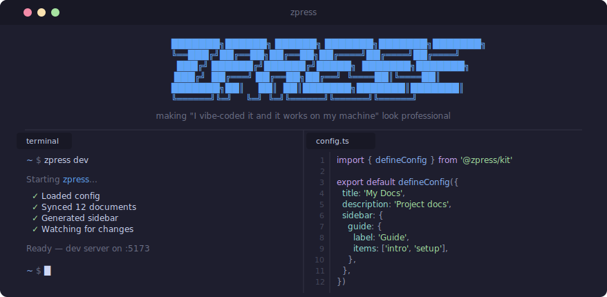

<div align="center">
  
  <p><strong>Zero-effort, turnkey documentation sites for monorepos — just point it at your existing docs.</strong></p>

<a href="https://github.com/joggrdocs/zpress/actions/workflows/ci.yml"></a>
<a href="https://www.npmjs.com/package/@zpress/kit"></a>
<a href="https://github.com/joggrdocs/zpress/blob/main/LICENSE"></a>

</div>

## Features

- **Your docs, your structure** — conforms to your repo, not the other way around.
- **One config, full chrome** — sidebars, nav, footer, edit links, version chip, announcement, and theme from one file.
- **Beautiful themes out of the box** — three built-in themes with full dark-mode support, plus first-class custom themes.
- **Monorepo-first** — built for internal docs with workspace cards, OpenAPI integration, and Liquid template support.

## Install

```bash
npm install @zpress/kit
```

## Usage

### Define your docs

```ts
// zpress.config.ts
import { defineConfig } from '@zpress/kit'

export default defineConfig({
  title: 'my-project',
  description: 'Internal developer docs',
  sections: [
    {
      title: 'Getting Started',
      path: '/getting-started',
      include: 'docs/getting-started/*.md',
    },
    {
      title: 'Guides',
      path: '/guides',
      include: 'docs/guides/*.md',
      icon: 'pixelarticons:book-open',
      sort: 'alpha',
    },
  ],
  theme: { name: 'midnight' },
  site: {
    version: 'v1.0',
    edit: { repo: 'acme/docs', branch: 'main', directory: 'docs' },
    report: { repo: 'acme/docs' },
    topbarCta: { text: 'Get started →', href: '/getting-started' },
  },
})
```

### Run it

```bash
npx zpress dev       # start dev server with hot reload
npx zpress build     # build for production
npx zpress serve     # preview production build
```

## Why `@zpress/kit` and not `zpress`?

The package is published as `@zpress/kit` because npm's moniker rules are overly aggressive and ban names that are similar in any way to existing packages. We will fix once we get npm to allow us to push to that namespace. If you work at `npm` please feel free to help out :)

## License

[MIT](LICENSE)
